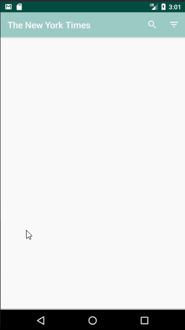

# Project 2 - *News Search*

**News Search** is an android app that allows a user to search for articles on web using simple filters. The app utilizes [New York Times Search API](http://developer.nytimes.com/docs/read/article_search_api_v2).

Time spent: **32** hours spent in total

## User Stories

The following **required** functionality is completed:

* [X] User can **search for news article** by specifying a query and launching a search. Search displays a grid of image results from the New York Times Search API.
* [X] User can click on "settings" which allows selection of **advanced search options** to filter results
* [X] User can configure advanced search filters such as:
  * [X] Begin Date (using a date picker)
  * [X] News desk values (Arts, Fashion & Style, Sports)
  * [X] Sort order (oldest or newest)
* [X] Subsequent searches have any filters applied to the search results
* [X] User can tap on any article in results to view the contents in an embedded browser.
* [X] User can **scroll down to see more articles**. The maximum number of articles is limited by the API search.

The following **optional** features are implemented:

* [X] Implements robust error handling, [check if internet is available](http://guides.codepath.com/android/Sending-and-Managing-Network-Requests#checking-for-network-connectivity), handle error cases, network failures
* [X] Used the **ActionBar SearchView** or custom layout as the query box instead of an EditText
* [X] User can **share an article link** to their friends or email it to themselves
* [X] Replaced Filter Settings Activity with a lightweight modal overlay

The following **bonus** features are implemented:

* [X] Use the [RecyclerView](http://guides.codepath.com/android/Using-the-RecyclerView) with the `StaggeredGridLayoutManager` to display improve the grid of image results
* [ ] For different news articles that only have text or only have images, use [Heterogenous Layouts](http://guides.codepath.com/android/Heterogenous-Layouts-inside-RecyclerView) with RecyclerView
* [X] Use Parcelable instead of Serializable using the popular [Parceler library](http://guides.codepath.com/android/Using-Parceler).
* [X] Leverages the [data binding support module](http://guides.codepath.com/android/Applying-Data-Binding-for-Views) to bind data into layout templates.
* [X] Replace all icon drawables and other static image assets with [vector drawables](http://guides.codepath.com/android/Drawables#vector-drawables) where appropriate.
* [X] Replace Picasso with [Glide](http://inthecheesefactory.com/blog/get-to-know-glide-recommended-by-google/en) for more efficient image rendering.
* [X] Uses [retrolambda expressions](http://guides.codepath.com/android/Lambda-Expressions) to cleanup event handling blocks.
* [X] Leverages the popular [GSON library](http://guides.codepath.com/android/Using-Android-Async-Http-Client#decoding-with-gson-library) to streamline the parsing of JSON data.
* [X] Leverages the [Retrofit networking library](http://guides.codepath.com/android/Consuming-APIs-with-Retrofit) to access the New York Times API.
* [X] Replace the embedded `WebView` with [Chrome Custom Tabs](http://guides.codepath.com/android/Chrome-Custom-Tabs) using a custom action button for sharing. (_**2 points**_)

The following **additional** features are implemented:

* [X] Added Snackbar display instead of Toast after Filter Settings are updated to provide a more seamless application flow.

## Video Walkthrough

Here's a walkthrough of implemented user stories:

GIF created with [LiceCap](http://www.cockos.com/licecap/).

## Notes

Describe any challenges encountered while building the app.
* [X] Handling network failures when API throttling is in place. Retroit turned out to be quite flexible and easy to use for handling such cases
* [X] Deciding the color palette to use for a text-heavy app such as a News app. The text needs to be readable with minimal background noise. Subdued color palette allowed for superior reading.
* [X] Use of drawables and scaling them based on the view in context

## Open-source libraries used

- [Glide](https://github.com/bumptech/glide) - An image loading and caching library for Android focused on smooth scrolling
- [okHttp](http://square.github.io/okhttp/) - An HTTP & HTTP/2 client for Android and Java applications
- [Gson](https://github.com/google/gson) - A Java serialization/deserialization library to convert Java Objects into JSON and back

## License

    Copyright [yyyy] [name of copyright owner]

    Licensed under the Apache License, Version 2.0 (the "License");
    you may not use this file except in compliance with the License.
    You may obtain a copy of the License at

        http://www.apache.org/licenses/LICENSE-2.0

    Unless required by applicable law or agreed to in writing, software
    distributed under the License is distributed on an "AS IS" BASIS,
    WITHOUT WARRANTIES OR CONDITIONS OF ANY KIND, either express or implied.
    See the License for the specific language governing permissions and
    limitations under the License.